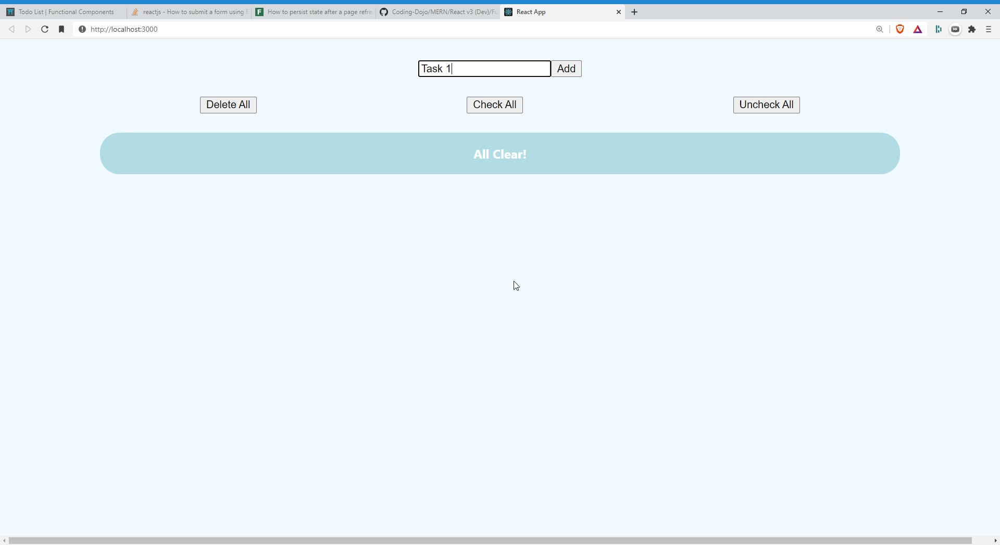

Todo List
Ah, the todo list! A ubiquitous project for any respectable JavaScript framework. Your job is to create a small React application to store and modify a list of tasks. Each task will have a text string as well as a completed property, which will be set to false initially. As you check off items, they should appear slashed out on the page. Using what you know about state and iterating through lists, render a list of items, and give the user the option to remove each item and add new ones. There are different ways to implement the remove function. One way to do it is using the built-in filter method. Filter returns a new array when invoked and is a great way to stay true to the functional nature of React.

Hint: When updating the state, make sure to send in a brand new object or array; otherwise React won't update the view.